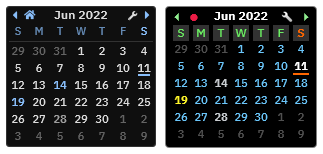
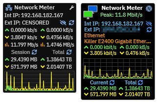
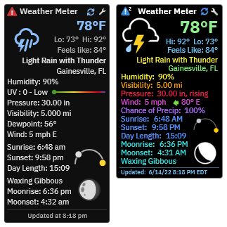

# Modernizer
**Gadgets theming utility inspired by raiguard's ModernGadgets suite.**

The Gadgets Modernizer Patch will replace the styling of the [Gadgets](https://github.com/SilverAzide/Gadgets/#readme) suite with a theme that more closely matches that of raiguard's [ModernGadgets](https://github.com/raiguard/ModernGadgets/#readme) suite. You may find the ModernGadgets theme is easier to read, especially at small font sizes. The graphics have an appearance that may blend in better with newer versions of Windows, particularly when partially transparent backgrounds are used.

Modernizing your Gadgets will change the primary font and background style for all skins. Graphics will be changed to have a flatter appearance and weather icons will be replaced with ones having a more modern style. **_Your custom colors and selected Gadget options will not be changed._** You can restore the original Gadgets appearance at any time.

###### Get help on the Rainmeter forums
[![Rainmeter Forum](https://img.shields.io/static/v1?label=Rainmeter%20Forum&message=Gadgets%20Modernizer&colorA=f0f0f0&colorB=2a6e9b&style=flat-square&logo=data%3Aimage%2Fpng%3Bbase64%2CiVBORw0KGgoAAAANSUhEUgAAAAsAAAAQCAYAAADAvYV%2BAAAABHNCSVQICAgIfAhkiAAAAAlwSFlzAAAESwAABEsBbzH2CgAAABl0RVh0U29mdHdhcmUAd3d3Lmlua3NjYXBlLm9yZ5vuPBoAAAH6SURBVCiRhdJPSJNhHAfw7%2FO8z%2Fu8%2F3w3bW05WVlr4XRzyw0iFRfF7FIepD8UQn9Mq8MWBnXpsPDapVuhyyKKqE4lHSoKqUPUwYQkgkqtiBAcCTU22db7dLFyueh3%2FPHh%2B%2BUHP6DCNCTS6yrt6d8LX%2FKyU2HSS39iqPm%2F2KXLF7aHvKajSr8BCPJPHDwx3GbT1c4z3TGpub62PnLq6qHKeM9tydS0a6ldW%2ByUEJze2W5yKp3bOHClehmOrM72tW7wOJs8TgCAw9Swvz1oU7g0WIajR4dkzthgfzxqLq3d1xbkFDgQOn7R9RtbVXJfrHGt7q4us1Bkhp6OsG7YjdQiFoQzluqPR8rlr1M2N3EI9PiS123Un0zH%2FHUOvlLnKH5%2BCuvbp2XpnWGfrEuFvUzjfNvWgLcm%2FyyFwtQdAAR8fRfUyACo4YY1%2FxaxBo8x9npmB5MAVZYoIbK2mCVQmBpFYfoeqOEGkRSwlhGACJXmiqWHD169n1eCvSDc9qdfWLCyX6C2JPB4ciaXzRdGpbkXdz%2Fooee77XaXK9RxmArLAmEq2KootNazmMh7xcjY%2BGwmI44QAAicvLTC5PxReE2tt3tTo72uxkTmew73J95ln7z5OJcrleKT53unlzyKIIFEusthMw5aQtRTgtmv2YVbysKPm%2BPDx4oA8BMJrI6FKL9sKAAAAABJRU5ErkJggg%3D%3D)](https://forum.rainmeter.net/viewtopic.php?t=41363)

##### NOTE:
The installer is in the form of a patch, which will patch your existing [Gadgets](https://github.com/SilverAzide/Gadgets/#readme) installation without affecting your current configuration or layouts. **_Gadgets v7.6.0 or later must be installed for this patch to function properly._**

## Screenshots
ModernGadgets skins are on the left, modernized Gadget skins are on the right. Colors are at their default values.

## Requirements
[Rainmeter 4.5.16 or later](https://www.rainmeter.net). 
[Gadgets 7.6.0 or later](https://github.com/SilverAzide/Gadgets/#readme). [Download the latest version here](https://github.com/SilverAzide/Gadgets/releases/latest).

## Attribution
* [Gadgets](https://github.com/SilverAzide/Gadgets/#readme) by [SilverAzide](https://github.com/SilverAzide).
* "IBM Plex Sans" font from Google Fonts, under the Apache 2.0 License.
* Resources from [ModernGadgets](https://github.com/raiguard/ModernGadgets/#readme) by raiguard, with minor modifications by me.
* Weather icons from [ASTRO Weather](https://www.deviantart.com/xenium-art/art/ASTRO-Weather-UPDATED-1-JUN-2022-798405481) by xenium-ART, with minor modifications by me.

## License
Creative Commons Attribution-NonCommercial-ShareAlike 4.0 International ([CC BY-NC-SA 4.0](https://creativecommons.org/licenses/by-nc-sa/4.0/))

---

